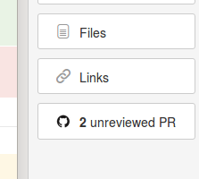
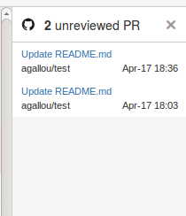

Unreviewed PR
=============

Displays a list of unreviewed PR in an HipChat Connect Glance.

* When your selected repositories have pull requests without any comment, the pull request count will be displayed in a glance:

* When you will click on the glance, the list of the pull requests without any comment will be displayed, and the links will allow you to access directy to those PR:

Prerequisites
-------------

* docker
* ngrok

Install
-------

* create an application on Github to be able to fill the GITHUB_CLIENT_ID and GITHUB_CLIENT_SECRET variables
* `cp docker-compose-dist.yml docker-compose.yml`
* define the `GITHUB_CLIENT_ID`, `GITHUB_CLIENT_SECRET`, `APP_URL`, `APP_DEBUG` environnement variables in the docker-compose.yml file 
* `docker-compose build`
* `docker-compose up`
* `./docker/bin/launch-bash`

    * `composer install`
    * `./vendor/bin/phinx migrate`

Dev tools
---------

* Connect to psql : `/docker/bin/psql`
